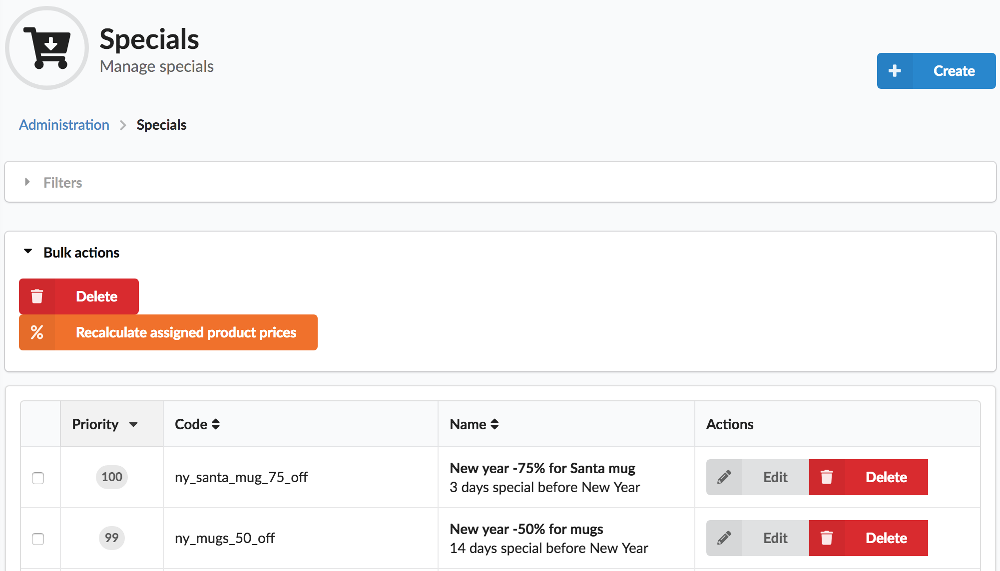
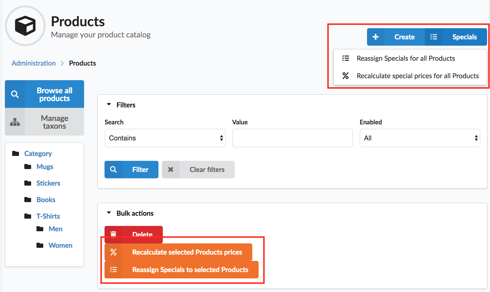

<p align="center">
    <a href="https://sylius.com" target="_blank">
        
    </a>
</p>

<h1 align="center">SetonoSyliusBulkSpecialsPlugin</h1>

<p align="center">

[![Latest Version on Packagist][ico-version]][link-packagist]
[![Software License][ico-license]](LICENSE)
[![Build Status][ico-travis]][link-travis]
[![Quality Score][ico-code-quality]][link-code-quality]

Plugin for Sylius 1.3 to define permanent or time-limited
Specials (discounts) for Products and automatically update prices.

Discounts calculated from `ChannelPrice`'s `originalPrice` field if it non-zero
and applies to `price` field. 

All calculations can be done immediately
(if you have not much products in your store) or asynchronously via queues.

</p>

Menu:


Specials admin page:



Products admin page actions:



## Install

### Add plugin to composer.json

```bash
composer require setono/sylius-bulk-specials-plugin
```

#### (optional) Add transport for enqueue bundle

(see https://github.com/php-enqueue/enqueue-dev/blob/master/docs/bundle/quick_tour.md
for more details)

```bash
composer require enqueue/fs
```

### Register plugin and enqueue bundle at AppKernel.php

```php
<?php
# config/bundles.php

return [
    // ...
    // Its important to instantiate SetonoSyliusBulkSpecialsPlugin
    // before calling parent::registerBundles()
    Setono\SyliusBulkSpecialsPlugin\SetonoSyliusBulkSpecialsPlugin::class => ['all' => true],
    Sylius\Bundle\GridBundle\SyliusGridBundle::class => ['all' => true],
    // ...
    // Uncomment if you want to use queues
    // Enqueue\Bundle\EnqueueBundle::class => ['all' => true],
    // ...
];

```

**Note**, that we MUST define `SetonoSyliusBulkSpecialsPlugin` BEFORE `SyliusGridBundle`.
Otherwise you'll see exception like this:

```bash
You have requested a non-existent parameter "setono_sylius_bulk_specials.model.special.class".  
```

### Add config

```yaml
# config/packages/_sylius.yaml
imports:
    - { resource: "@SetonoSyliusBulkSpecialsPlugin/Resources/config/app/config.yml" }
```

#### (optional) Add proper enqueue bundle configuration

```yaml
# config/packages/_sylius.yaml

setono_sylius_bulk_specials:
    # If you want to use enqueue bundle to asynchronously handle
    # bulk actions - you should set `queue` parameter to true
    # and install/configure enqueue/enqueue-bundle with transport implementation
    queue: true

    # If your store have not more than 1000 products - you can use
    # plugin without any additional configuration or set `queue`
    # to default value (false)
    # queue: false

enqueue:
    transport:
        # Here we use enqueue/fs for testing as most simple transport implementation
        # @see https://enqueue.readthedocs.io/en/latest/transport/filesystem/
        default: fs
        fs:
            dsn: "file://%kernel.project_dir%/var/queue"
    client:
        traceable_producer: true
```

### Add routing

```yaml
# config/routes.yaml
setono_sylius_bulk_specials_admin:
    resource: "@SetonoSyliusBulkSpecialsPlugin/Resources/config/admin_routing.yml"
    prefix: /admin
```

### Extend `Product` model and `ProductRepository`

(see [test/Application](test/Application) for more details how to configure)

* Override config

    ```yaml
    # app/config/config.yml
    sylius_product:
        resources:
            product:
                classes:
                    model: AppBundle\Model\Product
                    repository: AppBundle\Doctrine\ORM\ProductRepository
                    controller: Setono\SyliusBulkSpecialsPlugin\Controller\ProductController
    ```

* Override model

    ```php
    <?php
    
    declare(strict_types=1);
    
    namespace AppBundle\Model;
    
    use Setono\SyliusBulkSpecialsPlugin\Model\ProductInterface;
    use Setono\SyliusBulkSpecialsPlugin\Model\SpecialSubjectTrait;
    use Sylius\Component\Core\Model\Product as BaseProduct;
    
    /**
     * Class Product
     */
    class Product extends BaseProduct implements ProductInterface
    {
        use SpecialSubjectTrait {
            SpecialSubjectTrait::__construct as private __specialSubjectTraitConstruct;
        }
    
        public function __construct()
        {
            $this->__specialSubjectTraitConstruct();
    
            parent::__construct();
        }
    }
    ```
    
* Override mapping

    ```xml
    <?xml version="1.0" encoding="UTF-8"?>
    
    <doctrine-mapping xmlns="http://doctrine-project.org/schemas/orm/doctrine-mapping"
                      xmlns:gedmo="http://gediminasm.org/schemas/orm/doctrine-extensions-mapping"
                      xmlns:xsi="http://www.w3.org/2001/XMLSchema-instance"
                      xsi:schemaLocation="http://doctrine-project.org/schemas/orm/doctrine-mapping
                                          http://doctrine-project.org/schemas/orm/doctrine-mapping.xsd">
    
        <mapped-superclass name="AppBundle\Model\Product">
            <many-to-many field="specials" target-entity="Setono\SyliusBulkSpecialsPlugin\Model\SpecialInterface">
                <cascade>
                    <cascade-persist />
                </cascade>
                <order-by>
                    <order-by-field name="priority" direction="DESC" />
                </order-by>
                <join-table name="setono_sylius_bulk_specials_products">
                    <join-columns>
                        <join-column name="special_id" referenced-column-name="id" nullable="false" on-delete="CASCADE" />
                    </join-columns>
                    <inverse-join-columns>
                        <join-column name="channel_id" referenced-column-name="id" nullable="false" on-delete="CASCADE" />
                    </inverse-join-columns>
                </join-table>
            </many-to-many>
        </mapped-superclass>
    
    </doctrine-mapping>
    
    ```

* Override repository

    ```php
    <?php
    # Doctrine/ORM/ProductRepository.php
    
    declare(strict_types=1);
    
    namespace AppBundle\Doctrine\ORM;
    
    use Setono\SyliusBulkSpecialsPlugin\Doctrine\ORM\ProductRepositoryTrait;
    use Setono\SyliusBulkSpecialsPlugin\Doctrine\ORM\ProductRepositoryInterface;
    use Setono\SyliusBulkSpecialsPlugin\Special\QueryBuilder\Rule\RuleQueryBuilderAwareInterface;
    use Sylius\Bundle\CoreBundle\Doctrine\ORM\ProductRepository as BaseProductRepository;
    
    /**
     * Class ProductRepository
     */
    class ProductRepository extends BaseProductRepository
        implements ProductRepositoryInterface, RuleQueryBuilderAwareInterface
    {
        use ProductRepositoryTrait;
    }
    ``` 

* Override `ProductRepository` service definition as it shown at 
  [tests/Application/src/AppBundle/Resources/config/services.xml](tests/Application/src/AppBundle/Resources/config/services.xml).

### Update your schema (for existing project)

```bash
# Generate and edit migration
bin/console doctrine:migrations:diff

# Then apply migration
bin/console doctrine:migrations:migrate
```

### Install assets

```bash
bin/console sylius:install:assets
```

### Configure CRON to run next command every minute

```bash
bin/console setono:sylius-bulk-specials:check-active
```

This required to enable/disable Specials that have `startsAt`/`endsAt` defined.

### (optional) Configure `supervisord` on production if you use queues 

Make sure next command always in run state:

```bash
bin/console enqueue:consume 
```

This can be done with `supervisord`
(see [docs](https://enqueue.readthedocs.io/en/latest/bundle/production_settings/) for details):

```
[program:enqueue_message_consumer]
command=/path/to/app/console --env=prod --no-debug --time-limit="now + 5 minutes" enqueue:consume
process_name=%(program_name)s_%(process_num)02d
numprocs=4
autostart=true
autorestart=true
startsecs=0
user=apache
redirect_stderr=true
```

# How to use

Lets list what bulk actions we have to execute:

- `Reassign Specials for all Products`
  - Click `Admin > Products > Specials menu > Reassign Specials for all Products`.
  - OR run: `bin/command setono:sylius-bulk-specials:reassign` 

- `Recalculate special prices for all Products`
  - Click`Admin > Products > Specials menu > Recalculate special prices for all Products`.
  - OR run: `bin/command setono:sylius-bulk-specials:recalculate-product`

- `Recalculate selected Products prices`
  - Click `Admin > Products > Bulk actions > Recalculate selected Products prices`.
  - OR run: `bin/command setono:sylius-bulk-specials:recalculate-product PRODUCT_CODE`

- `Reassign Specials to selected Products`
  - Click `Admin > Products > Bulk actions > Reassign Specials to selected Products`.
  - OR run: `bin/command setono:sylius-bulk-specials:reassign PRODUCT_CODE`

- `Recalculate prices for Products matching Special rules`
  - Select special rules you want to recalculate
    and click `Admin > Specials > Bulk actions > Recalculate prices for Products matching Special rules`.
  - OR run: `bin/command setono:sylius-bulk-specials:recalculate-special SPECIAL_CODE`

### After new Bulk Special created

- Special will be automatically assigned to Products
  matching Special's rules (via Doctrine Lifecycle Events Listener).

### After Bulk Special updated

- If `action type` or `action percent` was changed -
  all Products assigned to updated Special will be recalculated
  automatically

- If `channels` list was changed - you should recalculate prices
  for this Special
  (see `Recalculate prices for Products matching Special rules`)

- If `rules` updated - you should reassign Products to updated Special.

  This can be done by executing `Reassign Specials for all Products` action.

  After reassigning - you should recalculate prices for all Products
  (see `Recalculate special prices for all Products`).

  Why we need to recalculate all - because some products potentially
  still have inactual prices based on old Special rules.

### After new Product created

- Specials (that have rules matching this new Product)
  will be automatically assigned to it
  and then prices will be automatically recalculated.


### After Product's `originalPrice` updated

- Special price will be recalculated automatically based on previously
  assigned Specials (via Doctrine Lifecycle Events Listener).

### If you not getting expected result

- Please, bugreport this
- And run `Reassign Specials for all Products` &
  `Recalculate special prices for all Products`

# Contribution

## Installation

To automatically execute installation steps, load fixtures 
and run server with just one command, run:

```bash
# Optional step, if 5 mins enough for webserver to try
# @see https://getcomposer.org/doc/06-config.md#process-timeout
composer config --global process-timeout 0

composer try
```

or follow next steps manually:

* Initialize:

    ```bash
    SYMFONY_ENV=test
    (cd tests/Application && yarn install) && \
        (cd tests/Application && yarn build) && \
        (cd tests/Application && bin/console assets:install public -e $SYMFONY_ENV) && \
        (cd tests/Application && bin/console doctrine:database:create -e $SYMFONY_ENV) && \
        (cd tests/Application && bin/console doctrine:schema:create -e $SYMFONY_ENV)
    ```

* If you want to manually play with plugin test app, run:

    ```bash
    SYMFONY_ENV=test
    (cd tests/Application && bin/console sylius:fixtures:load --no-interaction -e $SYMFONY_ENV && \
        (cd tests/Application && bin/console server:run -d public -e $SYMFONY_ENV)
    ```

## Running plugin tests

  - PHPSpec

    ```bash
    $ composer phpspec
    ```

  - Behat (non-JS scenarios)

    ```bash
    $ composer behat
    ```

  - All tests (phpspec & behat)

    ```bash
    $ composer test
    ```

  - Behat (JS scenarios)
 
    1. Download [Chromedriver](https://sites.google.com/a/chromium.org/chromedriver/)
    
    2. Download [Selenium Standalone Server](https://www.seleniumhq.org/download/).
    
    2. Run Selenium server with previously downloaded Chromedriver:
    
        ```bash
        $ java -Dwebdriver.chrome.driver=chromedriver -jar selenium-server-standalone.jar
        ```
        
    3. Run test application's webserver on `localhost:8080`:
    
        ```bash
        $ (cd tests/Application && bin/console server:run localhost:8080 -d public -e test)
        ```
    
    4. Run Behat:
    
        ```bash
        $ vendor/bin/behat --tags="@javascript"
 
[ico-version]: https://img.shields.io/packagist/v/setono/sylius-bulk-specials-plugin.svg?style=flat-square
[ico-license]: https://img.shields.io/badge/license-MIT-brightgreen.svg?style=flat-square
[ico-travis]: https://img.shields.io/travis/Setono/SyliusBulkSpecialsPlugin/master.svg?style=flat-square
[ico-code-quality]: https://img.shields.io/scrutinizer/g/Setono/SyliusBulkSpecialsPlugin.svg?style=flat-square

[link-packagist]: https://packagist.org/packages/setono/sylius-bulk-specials-plugin
[link-travis]: https://travis-ci.org/Setono/SyliusBulkSpecialsPlugin
[link-code-quality]: https://scrutinizer-ci.com/g/Setono/SyliusBulkSpecialsPlugin
