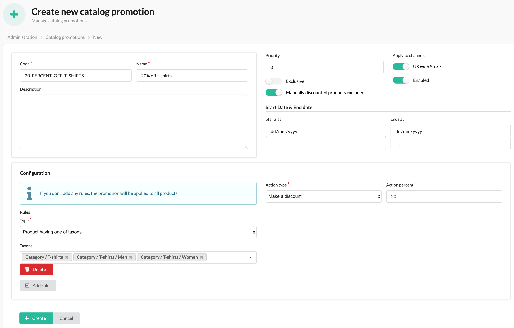

# Sylius Catalog Promotion Plugin

[![Latest Version][ico-version]][link-packagist]
[![Latest Unstable Version][ico-unstable-version]][link-packagist]
[![Software License][ico-license]](LICENSE)
[![Build Status][ico-github-actions]][link-github-actions]

Plugin for Sylius to define permanent or time-limited promotions for products and automatically update prices.



## Install

### Add plugin to composer.json

```bash
composer require setono/sylius-catalog-promotion-plugin
```

### Register plugin

```php
<?php
# config/bundles.php

return [
    // ...
    Setono\JobStatusBundle\SetonoJobStatusBundle::class => ['all' => true],
    Setono\SyliusCatalogPromotionPlugin\SetonoSyliusCatalogPromotionPlugin::class => ['all' => true],
    Sylius\Bundle\GridBundle\SyliusGridBundle::class => ['all' => true],
    // ...
];

```

**Note**, that we MUST define `SetonoSyliusCatalogPromotionPlugin` BEFORE `SyliusGridBundle`.
Otherwise you'll see exception like this:

```bash
You have requested a non-existent parameter "setono_sylius_catalog_promotion.model.promotion.class".  
```

### Add config

```yaml
# config/packages/setono_sylius_catalog_promotion.yaml
imports:
    - { resource: "@SetonoSyliusCatalogPromotionPlugin/Resources/config/app/config.yaml" }
    # Uncomment if you want to add some catalog promotion fixtures to default suite
    # - { resource: "@SetonoSyliusCatalogPromotionPlugin/Resources/config/app/fixtures.yaml" }
```

### Add routing

```yaml
# config/routes/setono_sylius_catalog_promotion.yaml
setono_sylius_catalog_promotion_admin:
    resource: "@SetonoSyliusCatalogPromotionPlugin/Resources/config/admin_routing.yaml"
    prefix: /admin
```

### Extend core classes
#### Extend `ChannelPricing`
```php
<?php

declare(strict_types=1);

namespace App\Entity\Channel;

use Doctrine\ORM\Mapping as ORM;
use Setono\SyliusCatalogPromotionPlugin\Model\ChannelPricingInterface as CatalogPromotionChannelPricingInterface;
use Setono\SyliusCatalogPromotionPlugin\Model\ChannelPricingTrait as CatalogPromotionChannelPricingTrait;
use Sylius\Component\Core\Model\ChannelPricing as BaseChannelPricing;

/**
 * @ORM\Table(name="sylius_channel_pricing")
 * @ORM\Entity()
 */
class ChannelPricing extends BaseChannelPricing implements CatalogPromotionChannelPricingInterface
{
    use CatalogPromotionChannelPricingTrait;
}
```

#### Extend `ChannelPricingRepository`
```php
<?php

declare(strict_types=1);

namespace App\Repository;

use Setono\SyliusCatalogPromotionPlugin\Doctrine\ORM\ChannelPricingRepositoryTrait as CatalogPromotionChannelPricingRepositoryTrait;
use Setono\SyliusCatalogPromotionPlugin\Repository\ChannelPricingRepositoryInterface as CatalogPromotionChannelPricingRepositoryInterface;
use Sylius\Bundle\ResourceBundle\Doctrine\ORM\EntityRepository;

class ChannelPricingRepository extends EntityRepository implements CatalogPromotionChannelPricingRepositoryInterface
{
    use CatalogPromotionChannelPricingRepositoryTrait;
}
```

#### Extend `ProductRepository`
```php
<?php

declare(strict_types=1);

namespace App\Repository;

use Setono\SyliusCatalogPromotionPlugin\Doctrine\ORM\ProductRepositoryTrait as CatalogPromotionProductRepositoryTrait;
use Setono\SyliusCatalogPromotionPlugin\Repository\ProductRepositoryInterface as CatalogPromotionProductRepositoryInterface;
use Sylius\Bundle\CoreBundle\Doctrine\ORM\ProductRepository as BaseProductRepository;

class ProductRepository extends BaseProductRepository implements CatalogPromotionProductRepositoryInterface
{
    use CatalogPromotionProductRepositoryTrait;
}
```

#### Extend `ProductVariantRepository`
```php
<?php

declare(strict_types=1);

namespace App\Repository;

use Setono\SyliusCatalogPromotionPlugin\Doctrine\ORM\ProductVariantRepositoryTrait as CatalogPromotionProductVariantRepositoryTrait;
use Setono\SyliusCatalogPromotionPlugin\Repository\ProductVariantRepositoryInterface as CatalogPromotionProductVariantRepositoryInterface;
use Sylius\Bundle\CoreBundle\Doctrine\ORM\ProductVariantRepository as BaseProductVariantRepository;

class ProductVariantRepository extends BaseProductVariantRepository implements CatalogPromotionProductVariantRepositoryInterface
{
    use CatalogPromotionProductVariantRepositoryTrait;
}
```

#### Update config with extended classes
In your `config/packages/_sylius.yaml` file update the configured classes:

```yaml
# config/packages/_sylius.yaml
sylius_core:
    resources:
        channel_pricing:
            classes:
                model: App\Entity\ChannelPricing
                repository: App\Repository\ChannelPricingRepository

sylius_product:
    resources:
        product:
            classes:
                repository: App\Repository\ProductRepository
        product_variant:
            classes:
                repository: App\Repository\ProductVariantRepository

```

### Update your schema

Create a migration file:

```bash
$ php bin/console doctrine:migrations:diff
```

If you have existing discounted products you should append this line to the `up` method in the migration file:
```php
<?php
namespace DoctrineMigrations;

use Doctrine\DBAL\Schema\Schema;
use Doctrine\Migrations\AbstractMigration;

final class Version20191028134956 extends AbstractMigration
{
    public function up(Schema $schema) : void
    {
        // The generated SQL will be here
        // ...
        
        // append this line
        $this->addSql('UPDATE sylius_channel_pricing SET manually_discounted = 1 WHERE original_price IS NOT NULL AND price != original_price');
    }

    public function down(Schema $schema) : void
    {
        // ...
    }
}
```

Execute migration file:
```bash
$ php bin/console doctrine:migrations:migrate
```

### Install assets

```bash
bin/console sylius:install:assets
```

### Configure CRON to run next command every minute

```bash
$ php bin/console setono:sylius-catalog-promotion:process
```

[ico-version]: https://poser.pugx.org/setono/sylius-catalog-promotion-plugin/v/stable
[ico-unstable-version]: https://poser.pugx.org/setono/sylius-catalog-promotion-plugin/v/unstable
[ico-license]: https://poser.pugx.org/setono/sylius-catalog-promotion-plugin/license
[ico-github-actions]: https://github.com/Setono/SyliusCatalogPromotionPlugin/workflows/build/badge.svg

[link-packagist]: https://packagist.org/packages/setono/sylius-catalog-promotion-plugin
[link-github-actions]: https://github.com/Setono/SyliusCatalogPromotionPlugin/actions
